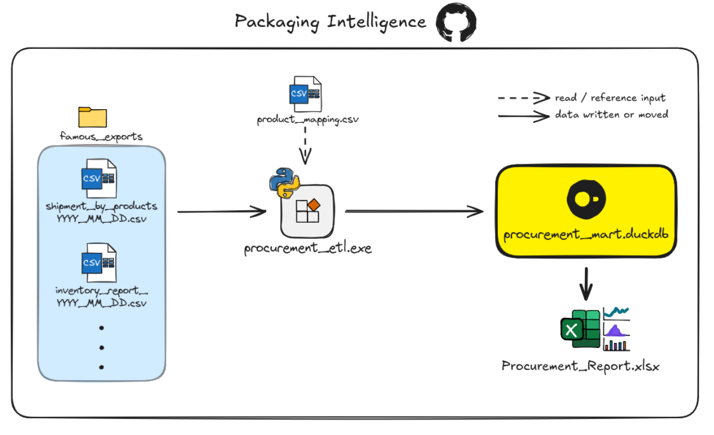
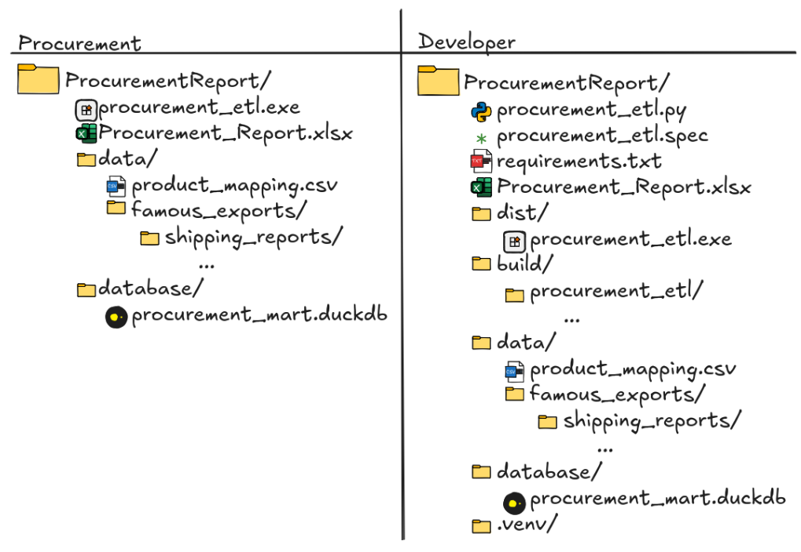
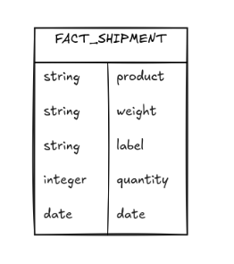

# procurement-packaging-report

A lightweight packaging procurement analytics project that transforms Famous ERP shipping exports with Python, stores aggregated packaging usage in DuckDB, and exposes the results to Excel for reporting and analysis.

## Business Purpose
Procurement needs a reliable view of what has shipped so they can determine confirmed packaging and box consumption.

## Architecture



1. Famous ERP Exports - we manually export a CSV and drop in ```data/famous_exports/shipping_reports``` folder.
2. Procurement ETL - a Python script that grabs the respective column data from the CSV files and then counts total packaging/box combinations.
3. Product Mapping CSV - file that is read by the script to count all the different pack styles.
4. Procurement DB - stores aggregated packaging quantities by product combination and report data. 
5. Procurement Dashboard - Excel reporting layer connected to DuckDB for filtering and analyzing packaging usage. 

## Technology Stack

 - Python: used for the ETL logic and file processing. 
 - pandas: used for read, transform, filter, and aggregate Famous ERP exports. 
 - Regular expressions: used to match Famous product descriptions to configured pack style and label combinations.
 - DuckDB: lightweight embedded analytical database suitable for the size and deployment requirements of the project.
 - ODBC: provides connection between DuckDB and Excel.
 - Excel: reporting interface already available to procurement. 
 - Pyinstaller: packages the Python ETL script into a standalone executable. 

## Project Structure



*Note: some files are not on repository since they contain company information, hence omission* 

## Input Data

### Shipping Report

- Format for export: ```shipments_by_product_YYYY_MM_DD.csv```
- Date is important because it represents what day the data is from and we use as a column in our database
- Save to: ```data/famous_exports/shipping_reports```
- Columns we want: ```productdescr``` renamed to ```product``` and ```qnt1``` renamed to ```quantity```

## Product Mapping

- Columns: ```weight``` and ```label```
- The pack style on the company side reads more like a weight and it tells procurement what packaging was used and the label tells us which box it was packed into
- Exists outside of the executable so procurement can quickly update if need be and no need for rebuilding
- Procurement simply opens it up in text editor and adds a line with a weight and label combination separated by a comma, save, and can run executable to get count

## ETL Logic

### Extract

- Locate the shipping reports
- Read only the required columns
- Extract date from filename

### Transform 

- Rename columns
- Match product descriptions against mapping rules
- Use regular expressions to avoid incorrect matches/double counting
- Aggregate quantities
- Add report date

### Load

- Build/rebuild ```fact_shipment```
- Insert transformed rows into DuckDB
- Make data available to Excel 

## DuckDB Model



- ```product```: the concatenation of ```weight``` and ```label```, used as a human-readable reporting category.
- ```weight```: the pack style
- ```label```: the box style
- ```quantity```: aggregated count of weight and label combinations
- ```date```: the date of the exported CSV from Famous

*One row represents the aggregated quantity for a single weight/label combination on a single report date*

## User Workflow

1. Export the report from Famous.
2. Rename it using the required naming convention shown in [Input Data](#input-data) section.
3. Place it in the shipping reports folder.
4. Run the procurement executable.
5. Open the Excel report.
6. Confirm the data refresh completes successfully.
7. Select the desired reporting period.

## Installation / Initial Setup

1. Copy the ```ProcurementReport``` folder to the user's computer 
2. Install the 64-bit [DuckDB ODBC driver](https://duckdb.org/docs/current/clients/odbc/windows)
3. Create/configure the DuckDB ODBC DSN
4. Point the DSN to ```database/procurement_mart.duckdb```
5. Open the Excel workbook 
6. Configure/verify the Power Query connection
7. Enable refresh on workbook open
8. Test the executable with a known report

## Building the Executable

For developer/maintenance use:
```powershell
python -m pip install -r requirements.txt
```  
after creating a ```.venv``` in project folder

For building the executable use:
```powershell
pyinstaller --onefile procurement_etl.py
```  
the generated executable will be available in the ```dist/``` directory

## Troubleshooting

### Report does not appear

- has the report been created the first time around?
- does the report have a different name now?

### Product quantity looks wrong

- are there missing files?
- are there spelling/format mistakes in ```product_mapping.csv```?
- are the correct ```weight``` and ```label``` values in ```product_mapping.csv```?

### Excel does not update

- has the ```procurement_mart.duckdb``` been moved or deleted?
- is the ODBC DSN configured correctly? 
- is the Power Query connection active?
- have you tried a manual refresh? 

### Executable cannot find files

- have you changed the folder structure from what is depicted in [Project Structure](#project-structure)?
- are the ```data/``` and ```database/``` folders present?
- has the executable itself been removed?

## Known Limitations

- Shipping reports filenames must follow the required naming convention.
- Required Famous columns must remain unchanged.
- Pack style criteria must exist in ```product_mapping.csv``` to be counted.
- Missing shipping report files for operational days will cause incomplete period totals.
- The ETL currently rebuilds ```fact_shipment``` from the source files present in the export folder.
- Famous exports are currently created manually.
- Inventory and waste tracking are planned but not yet implemented.
- Excel requires a working DuckDB ODBC connection.

## Future Improvements

- [ ] Add logging
- [ ] Automatic report naming
- [ ] Duplicate file detection
- [ ] Automatic file validation
- [ ] Implement tests for ETL script
- [ ] Automate CSV exports and grab them via email
- [ ] Add user-facing messages upon start, completion, and errors
- [ ] Incremental loading of data instead of full rebuild

