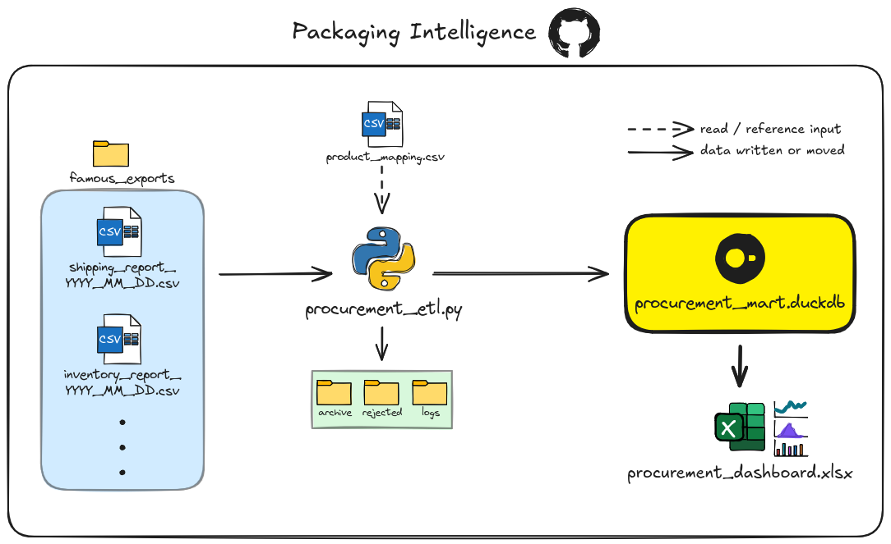

## Overview

# procurement-packaging-report
A lightweight packaging procurement analytics project that transforms Famous ERP exports with Python and delivers Excel reporting for inventory, usage, waste tracking, reorder planning, and basic forecasting.

## Business Purpose
Procurement wants a snapshot of current inventory and what has already gone out so they know how much packaging and boxes have already been used versus what we have in on-site.
Eventually we would want to track how much is wasted/garbage as well. The main purpose is to figure when to order and from whom based on time of the season and prices from last year.

## Architecture



1. Famous ERP Exports - for now we manually export a CSV and drop in ```data/famous_exports/shipping_reports``` folder. We would like to have one for inventory eventually and that the exports be automated to an email daily which we can grab from.
2. Procurement ETL - this is a Python script that grabs the respective data from the CSV files and then count how many of each product was packed that day in aggregation.
3. Product Mapping CSV - file that is read by the script to count all the different pack styles. Should a new pack style need to be counted procurement can edit this file to add it.
4. Procurement DB - where we store the aggregated counts by report date.
5. Procurement Dashboard - connected to database, shows procurement the numbers that they want to see.

*Note: some files are not on repository since they contain company information, hence omission* 

## Technology Stack
 - Python: has the libraries we want to help us process data and easy to work with
 - pandas: simplifies data reading, extraction, cleaning, and organizing
 - regular expressions: this is how we match the data in the exports and the ```product_mapping.csv``` to sum up the counts for the packing style
 - DuckDB: where our data is stored after processing. A proper database installation, Docker container, or cloud platform would be too much for this project
 - Excel: what the procurement will open to see the numbers/visualisations and they already have a license.
 - Power Query: how the data is loaded into Excel.
 - ODBC: has to be installed onto the computer in order for Excel to connect to the DuckDB.
 - Pyinstaller: makes script into an executable that procurement just needs to double click when new data is added to exports

## Project Structure

*this is where we add the image from excali*

PROCUREMENT - gets only the files/folders they need see/use.
DEVELOPER - the ```dist```,```build``` folders, and ```procurement.spec``` are generated when ```Pyinstaller``` is run on the ```procurement_etl.py``` file. The person working on this is works with the main ```.py``` file.

## Input Data
# Shipping Report
- format for export: ```shipments_by_products_YYYY_MM_DD.csv```
- date is important because it represents what day the data is from and we use as a column in our database
- save to: ```data/famous_exports/shipping_reports```
- columns we want: ```productdesc``` -> ```product``` and ```qnt1``` -> ```quantity```

## Product Mapping
- columns: ```weight``` and ```label```
- the pack style on the company side reads more like a weight and it tells procurement what packaging was used and the label tells us which box it was packed into
- exists outside of the executable so procurement can quickly update if need be
- procurement simply opens it up in text editor and adds a line with a weight and label combination separated by a comma, save, and can run executable to get count
- no need for rebuilding after update

## ETL Logic
# Extract
- Locate the shipping reports
- Read only the required columns
- Extract date from filename

# Transform 
- Rename columns
- Match product descriptions against mapping rules
- Use regular expressions to avoid incorrect matches/double counting
- Aggregate quantities
- Add report date

# Load
- Build/rebuild ```fact_shipment```
- Insert transformed rows into DuckDB
- Make data available to Excel 

## DuckDB Model

*fact_shipment insert here image here*

- product: the concatenation of label and weight and for display purposes
- weight: the package style
- label: the box style
- quantity: aggregated count of weight and label combinations
- date: the date of the exported CSV from Famous

## Excel Reporting Layer
*maybe not include this for now* 

## User Workflow
1. Export the report from Famous
2. Rename it using the required naming convention shown in [Input Data](#Input Data) section
3. Place it in the shipping reports folder
4. Run the procurement executable
5. Open the Excel report
6. Refresh the workbook if necessary
7. Select the desired reporting period

## Installation / Initial Setup
- [DuckDB ODBC driver requirement](https://duckdb.org/docs/current/clients/odbc/windows)

## Building the Executable
For developer/maintenance use:
```python -m pip install -r requirements.txt```
after creating a venv

For building the executable use:
```pyinstaller --onefile procurement_etl.py```
```
```
```
